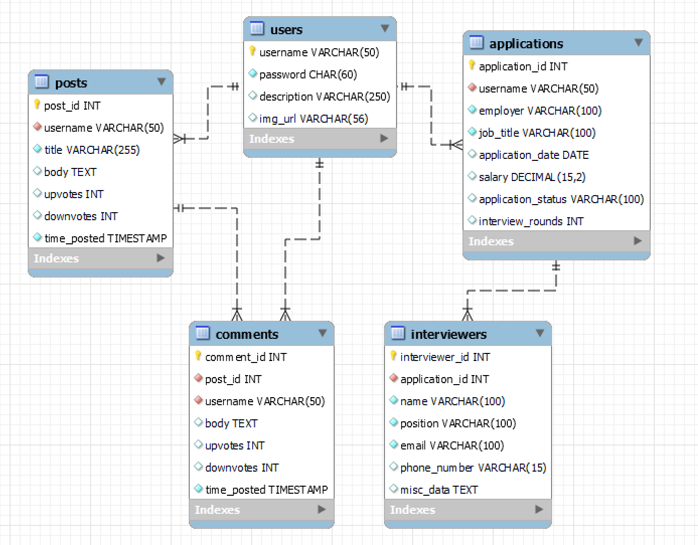

# Career Compass

## Change Log 11/15

#### Completed:  
* set up handlebars  
* implement more modular testing so each test can be a different file  
* implement header/footer partials (website modularity)  
* implemented partials needed for page rendering (HTML/HBS skeleton pages)  
* implemented tests-cases for the get method for all pages and routes  

#### To Do:  
* implement routes for post methods  
* register/login  
* dynamic element generation from database queries  
* tests for each new feature  

## Change Log 11/8

#### Completed:  
* finished setting up docker-compose.yaml  
* got test cases working  
* created the sql databases  
* updated our InitData folder  

#### To Do:  
* ✔ more functionally modular website  
* ✔ HTML skeleton pages  
* ✔ set up handlebars  

## ER Diagram

